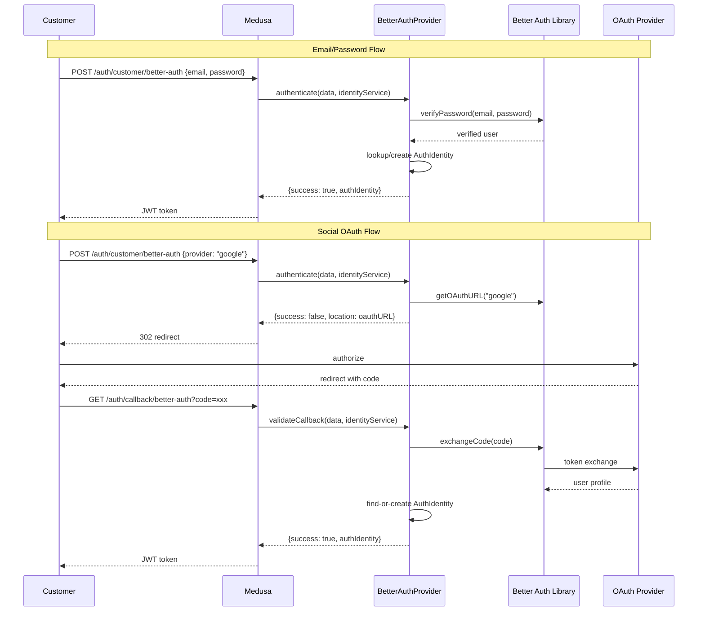

# Auth Better Auth

P1 priority. Modern auth framework providing social login, magic links, email/password, and advanced session management. Bridges Better Auth's capabilities into Medusa's auth identity system.

**Docs:** [docs/plugins/auth.md](docs/plugins/auth.md), [docs/providers/auth-better-auth.md](docs/providers/auth-better-auth.md)
**Package:** `@peyya/medusa-auth-better-auth` in `packages/auth-better-auth/`

---

## Phase 1 -- Scaffold

```
packages/auth-better-auth/
  src/providers/better-auth/
    service.ts       # BetterAuthProviderService extends AbstractAuthModuleProvider
    index.ts         # ModuleProvider(Modules.AUTH, { services: [...] })
    types.ts         # BetterAuthOptions, social provider types
  package.json
  tsconfig.json
  README.md
```

### package.json

```json
{
  "name": "@peyya/medusa-auth-better-auth",
  "version": "0.0.1",
  "description": "Better Auth provider for Medusa v2 -- social login, magic links, session management",
  "keywords": ["medusa-v2", "medusa-plugin-integration", "medusa-plugin-auth"],
  "exports": {
    ".": "./dist/index.js",
    "./providers/*": "./dist/providers/*/index.js"
  },
  "devDependencies": {
    "@medusajs/framework": "^2.5.0",
    "@medusajs/medusa": "^2.5.0",
    "@medusajs/cli": "^2.5.0",
    "@swc/core": "^1.5.7"
  },
  "peerDependencies": {
    "@medusajs/framework": "^2.5.0",
    "@medusajs/medusa": "^2.5.0"
  },
  "dependencies": {
    "better-auth": "<latest>"
  }
}
```

---

## Phase 2 -- Types

```typescript
type BetterAuthOptions = {
  secret: string                  // Better Auth signing secret
  baseURL: string                 // Storefront URL for OAuth callbacks
  socialProviders?: {
    google?: { clientId: string; clientSecret: string }
    github?: { clientId: string; clientSecret: string }
    apple?: { clientId: string; clientSecret: string; teamId: string; keyId: string }
  }
  emailAndPassword?: boolean      // Default: true
  magicLink?: {
    enabled: boolean
    emailTransport: { /* SMTP config */ }
  }
  session?: {
    maxAge: number                // Seconds
    refreshWindow: number         // Seconds before expiry to auto-refresh
  }
}
```

---

## Phase 3 -- Better Auth Integration

In the constructor, create a Better Auth server instance configured from options. This is the core auth engine.

**Architecture decision:** Better Auth handles the auth ceremony (password hashing, OAuth flow, magic link verification, session token generation). Medusa's `AuthIdentity` remains the source of truth for user identity. Better Auth runs in "stateless" mode -- no own user database.

---

## Phase 4 -- Provider Service

```
class BetterAuthProviderService extends AbstractAuthModuleProvider
  static identifier = "better-auth"
```

### 4.1 validateOptions

- `secret` present and not empty
- `baseURL` is a valid URL
- Each social provider has both `clientId` and `clientSecret`
- If `magicLink.enabled`, email transport config present

### 4.2 authenticate

Three flows based on `data.body`:

1. **Email/password** -- `{ email, password }` → verify via Better Auth → look up AuthIdentity by `entity_id: email` → return success
2. **Social OAuth** -- `{ provider: "google" }` → return `{ success: false, location: oauthURL }` to trigger redirect
3. **Magic link** -- `{ email, type: "magic_link" }` → trigger Better Auth to send email → return pending

### 4.3 register

1. **Email/password** -- hash password via Better Auth → `authIdentityProviderService.create()` with `entity_id: email`, store hash in provider metadata
2. **Social** -- delegate to authenticate (OAuth register = login for first-time users)

### 4.4 validateCallback

1. **OAuth callback** -- `{ code, state, provider }` → exchange code via Better Auth → extract user profile → find-or-create AuthIdentity
2. **Magic link** -- `{ token }` → verify token → find-or-create AuthIdentity

### 4.5 update

- Password change (verify old, hash new)
- Link/unlink social providers
- Update session preferences

---

## Auth Flow Diagram



---

## Phase 5 -- Module Provider Export

```typescript
import BetterAuthProviderService from "./service"
import { ModuleProvider, Modules } from "@medusajs/framework/utils"

export default ModuleProvider(Modules.AUTH, {
  services: [BetterAuthProviderService],
})
```

---

## Phase 6 -- Consumer Configuration

```typescript
module.exports = defineConfig({
  modules: [{
    resolve: "@medusajs/medusa/auth",
    options: {
      providers: [{
        resolve: "@peyya/medusa-auth-better-auth/providers/better-auth",
        id: "better-auth",
        options: {
          secret: process.env.BETTER_AUTH_SECRET,
          baseURL: process.env.STORE_URL,
          socialProviders: {
            google: {
              clientId: process.env.GOOGLE_CLIENT_ID,
              clientSecret: process.env.GOOGLE_CLIENT_SECRET,
            },
          },
        },
      }],
    },
  }],
})
```

---

## Phase 7 -- Tests and README

### Unit tests

- `authenticate` -- email/password success, wrong password fails, social redirect returns location, magic link sends email
- `register` -- creates AuthIdentity, duplicate email handled, password hashed
- `validateCallback` -- OAuth code exchange, magic link token verified
- `update` -- password change, social provider linked
- `validateOptions` -- missing secret throws, invalid social config throws

### README

- Supported flows (email/password, OAuth, magic links)
- Configuration with all env vars
- Auth flow diagrams
- Storefront integration guide

---

## Key Decisions

- **Better Auth as ceremony engine, Medusa as identity store** -- Better Auth handles password hashing, OAuth flows, magic link tokens. Medusa's AuthIdentity remains source of truth
- **No own database tables** -- auth providers store metadata in AuthIdentity's provider metadata field
- **Session bridging** -- primary session is Medusa's JWT; Better Auth session features are optional
