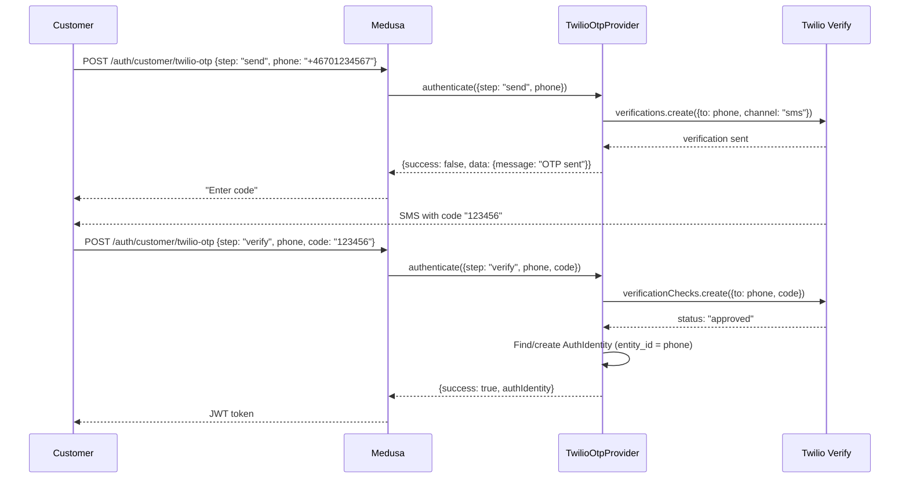

# Auth Twilio OTP

P2 priority. SMS-based one-time password verification via Twilio Verify. Standard Swedish pattern for phone verification, account creation, and 2FA.

**Docs:** [docs/plugins/auth.md](docs/plugins/auth.md)
**Package:** `@peyya/medusa-auth-twilio-otp` in `packages/auth-twilio-otp/`

---

## Phase 1 -- Scaffold

```
packages/auth-twilio-otp/
  src/providers/twilio-otp/
    service.ts       # TwilioOtpProviderService extends AbstractAuthModuleProvider
    index.ts         # ModuleProvider export
    types.ts         # TwilioOtpOptions
  package.json
  tsconfig.json
  README.md
```

### package.json key dependencies

```json
{
  "dependencies": {
    "twilio": "<latest>"
  }
}
```

---

## Phase 2 -- Types

```typescript
type TwilioOtpOptions = {
  accountSid: string
  authToken: string
  serviceSid: string         // Twilio Verify Service SID
  codeLength?: number        // Default 6
  channel?: "sms" | "whatsapp" | "call"  // Default "sms"
  locale?: string            // Default "sv" for Swedish SMS
}
```

---

## Phase 3 -- Twilio Verify Client

In the constructor, initialize the Twilio client:

```typescript
import Twilio from "twilio"

constructor(container, options) {
  super(container, options)
  this.client = Twilio(options.accountSid, options.authToken)
  this.serviceSid = options.serviceSid
}
```

---

## Phase 4 -- Provider Service

```
class TwilioOtpProviderService extends AbstractAuthModuleProvider
  static identifier = "twilio-otp"
```

### Two-step OTP flow

1. `authenticate({ step: "send", phone: "+46701234567" })` → send OTP via Twilio Verify → return `{ success: false, data: { message: "OTP sent" } }`
2. `authenticate({ step: "verify", phone: "+46701234567", code: "123456" })` → verify via Twilio → return AuthIdentity

### Method map

| Method             | Twilio OTP behavior                                                            |
| ------------------ | ------------------------------------------------------------------------------ |
| `validateOptions`  | Require `accountSid`, `authToken`, `serviceSid`                                |
| `authenticate`     | Step 1: send OTP to phone; Step 2: verify code, return AuthIdentity            |
| `register`         | Step 1: send OTP; Step 2: verify code, create AuthIdentity with entity_id=phone |
| `validateCallback` | Delegate to verify step                                                         |
| `update`           | Change phone number (send OTP to new number, verify, update identity)           |

### Twilio Verify API calls

```typescript
// Send OTP
await this.client.verify.v2
  .services(this.serviceSid)
  .verifications.create({
    to: phone,
    channel: this.options.channel || "sms",
    locale: this.options.locale || "sv",
  })

// Verify OTP
const check = await this.client.verify.v2
  .services(this.serviceSid)
  .verificationChecks.create({
    to: phone,
    code: code,
  })
// check.status === "approved"
```

---

## OTP Flow Diagram



---

## Phase 5 -- Consumer Configuration

```typescript
module.exports = defineConfig({
  modules: [{
    resolve: "@medusajs/medusa/auth",
    options: {
      providers: [{
        resolve: "@peyya/medusa-auth-twilio-otp/providers/twilio-otp",
        id: "twilio-otp",
        options: {
          accountSid: process.env.TWILIO_ACCOUNT_SID,
          authToken: process.env.TWILIO_AUTH_TOKEN,
          serviceSid: process.env.TWILIO_VERIFY_SERVICE_SID,
          channel: "sms",
          locale: "sv",
        },
      }],
    },
  }],
})
```

---

## Phase 6 -- Tests and README

### Unit tests

- Send OTP -- Twilio verification created
- Verify OTP -- approved code returns AuthIdentity, wrong code fails
- Rate limiting -- too many attempts handled gracefully
- `validateOptions` -- missing SIDs throws
- Phone format validation

### README

- Twilio account setup (Verify service creation)
- Configuration with env vars
- Swedish phone number format (+46)
- Cost considerations (Twilio pricing per SMS)
- WhatsApp channel alternative

---

## Key Decisions

- **Twilio Verify** -- not raw SMS API; Verify handles rate limiting, code generation, and expiry
- **Phone as entity_id** -- AuthIdentity `entity_id` is the phone number (E.164 format)
- **Two-step flow** -- same pattern as WebAuthn; `step` parameter in data body
- **Swedish locale** -- default locale "sv" for Swedish SMS content
