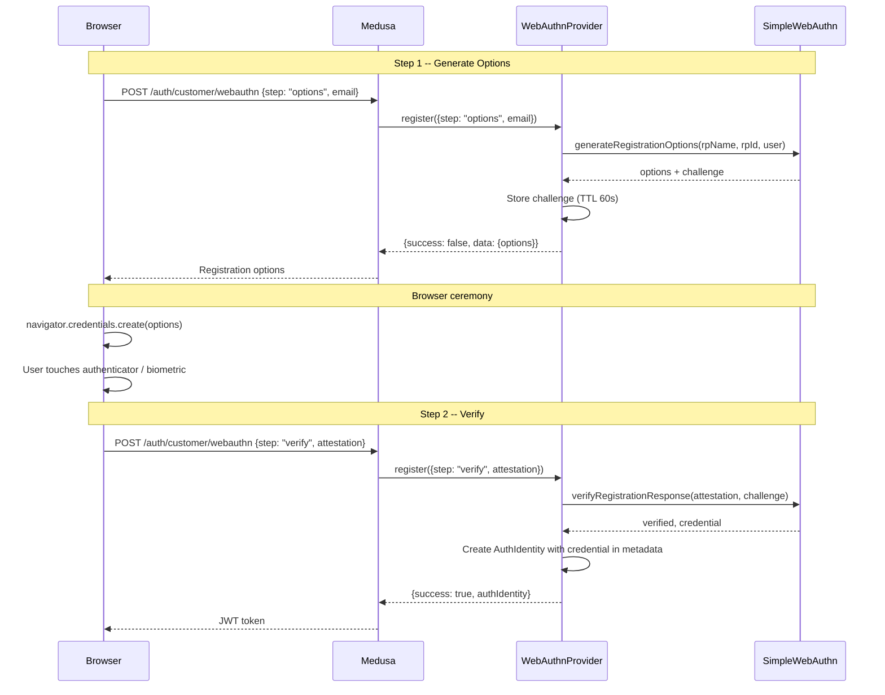

# Auth WebAuthn

P1 priority. FIDO2/WebAuthn standard for passwordless auth. Enables Apple/Google passkeys and prepares for Swedish BankID (moving toward FIDO2).

**Docs:** [docs/plugins/auth.md](docs/plugins/auth.md)
**Package:** `@peyya/medusa-auth-webauthn` in `packages/auth-webauthn/`

---

## Phase 1 -- Scaffold

```
packages/auth-webauthn/
  src/providers/webauthn/
    service.ts       # WebAuthnProviderService extends AbstractAuthModuleProvider
    index.ts         # ModuleProvider export
    types.ts         # WebAuthnOptions, credential types
    challenge.ts     # Challenge store (in-memory or cache-based)
  package.json
  tsconfig.json
  README.md
```

### package.json key dependencies

```json
{
  "dependencies": {
    "@simplewebauthn/server": "<latest>"
  }
}
```

---

## Phase 2 -- Types

```typescript
type WebAuthnOptions = {
  rpName: string          // "My Store" -- displayed during ceremony
  rpId: string            // "mystore.se" -- domain (no protocol)
  origin: string          // "https://mystore.se" -- full origin URL
  challengeTTL?: number   // Challenge expiry in ms (default 60000)
}

type StoredCredential = {
  credentialId: string
  publicKey: string       // Base64url encoded
  counter: number
  transports?: string[]
  createdAt: string
}
```

---

## Phase 3 -- Challenge Store

WebAuthn requires a challenge/response flow spanning multiple HTTP requests. The challenge must be stored between the options-generation step and the verification step.

Options:
- **In-memory Map** -- simple, works for single-instance deployments
- **Redis/cache** -- required for multi-instance deployments

The challenge store is injected via Medusa's container, defaulting to in-memory with an optional Redis adapter.

---

## Phase 4 -- Provider Service

```
class WebAuthnProviderService extends AbstractAuthModuleProvider
  static identifier = "webauthn"
```

### Two-step flows

WebAuthn requires two round trips per operation:

**Registration:**
1. `register({ step: "options", email })` → generate registration options (challenge, rp info) → store challenge → return options to browser
2. `register({ step: "verify", attestation })` → verify attestation via @simplewebauthn → create AuthIdentity with credential in provider metadata

**Authentication:**
1. `authenticate({ step: "options", email })` → look up stored credentials → generate authentication options → return to browser
2. `authenticate({ step: "verify", assertion })` → verify assertion → return AuthIdentity

### Method map

| Method             | WebAuthn behavior                                                                    |
| ------------------ | ------------------------------------------------------------------------------------ |
| `validateOptions`  | Require `rpName`, `rpId`, `origin`                                                   |
| `authenticate`     | Step 1: generate auth options; Step 2: verify assertion, return AuthIdentity          |
| `register`         | Step 1: generate registration options; Step 2: verify attestation, create AuthIdentity |
| `validateCallback` | Delegate to step 2 of authenticate/register                                          |
| `update`           | Add new passkey, remove passkey, list passkeys for an identity                        |

### Credential storage

Passkey credentials (public key, counter, transports) are stored in the AuthIdentity's provider metadata. Multiple passkeys per user are supported as an array.

---

## WebAuthn Registration Flow



---

## Phase 5 -- Consumer Configuration

```typescript
module.exports = defineConfig({
  modules: [{
    resolve: "@medusajs/medusa/auth",
    options: {
      providers: [{
        resolve: "@peyya/medusa-auth-webauthn/providers/webauthn",
        id: "webauthn",
        options: {
          rpName: "My Store",
          rpId: "mystore.se",
          origin: "https://mystore.se",
        },
      }],
    },
  }],
})
```

---

## Phase 6 -- Tests and README

### Unit tests

- Registration flow (both steps) with mocked @simplewebauthn
- Authentication flow (both steps) with mocked credentials
- Challenge expiry (expired challenge rejected)
- Multiple passkeys per user
- `validateOptions` -- missing rpId throws

### README

- Configuration
- Browser-side integration guide (`@simplewebauthn/browser`)
- BankID/FIDO2 readiness notes
- Security considerations (origin validation, challenge TTL)

---

## Key Decisions

- **@simplewebauthn/server** -- well-maintained, TypeScript-first WebAuthn library
- **Two-step flow** -- Medusa's auth interface doesn't natively support challenge/response; we use `step` parameter in data body
- **Credentials in provider metadata** -- no custom database tables; passkeys stored as JSON array in AuthIdentity
- **BankID path** -- when BankID adds FIDO2 support, this provider can accept BankID attestations without major changes
