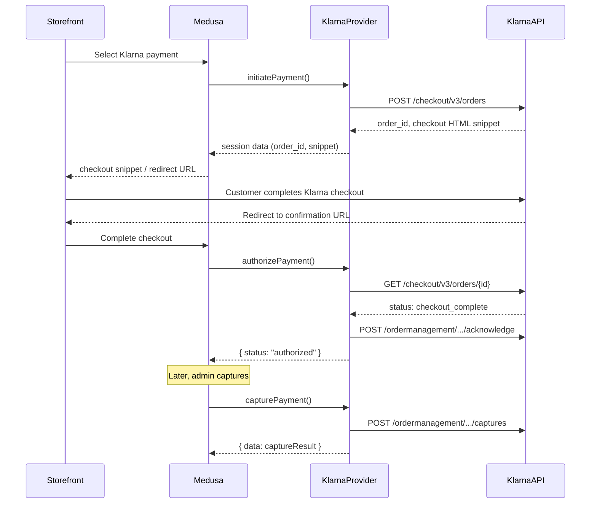

# Payment Klarna

P1 priority. Dominant checkout provider in the Nordics. Redirect-based checkout + embedded Klarna widget. Multi-currency.

**Docs:** [docs/plugins/payments.md](docs/plugins/payments.md), [docs/providers/payment-klarna.md](docs/providers/payment-klarna.md)
**Package:** `@peyya/medusa-payment-klarna` in `packages/payment-klarna/`

---

## Phase 1 -- Scaffold

### Directory structure

```
packages/payment-klarna/
  src/providers/klarna/
    service.ts       # KlarnaProviderService extends AbstractPaymentProvider
    index.ts         # ModuleProvider(Modules.PAYMENT, { services: [...] })
    types.ts         # KlarnaOptions, session/order types
    client.ts        # Klarna API client (Checkout v3 + Order Management)
    currency.ts      # Minor unit conversion utilities
  package.json
  tsconfig.json
  README.md
```

### package.json

```json
{
  "name": "@peyya/medusa-payment-klarna",
  "version": "0.0.1",
  "description": "Klarna checkout provider for Medusa v2",
  "keywords": ["medusa-v2", "medusa-plugin-integration", "medusa-plugin-payment"],
  "exports": {
    ".": "./dist/index.js",
    "./providers/*": "./dist/providers/*/index.js"
  },
  "devDependencies": {
    "@medusajs/framework": "^2.5.0",
    "@medusajs/medusa": "^2.5.0",
    "@medusajs/cli": "^2.5.0",
    "@swc/core": "^1.5.7"
  },
  "peerDependencies": {
    "@medusajs/framework": "^2.5.0",
    "@medusajs/medusa": "^2.5.0"
  }
}
```

---

## Phase 2 -- Types and Currency Utils

### types.ts

```typescript
type KlarnaOptions = {
  username: string          // Klarna API username (eid_xxx)
  password: string          // Klarna API password
  region: "eu" | "na" | "oc"
  environment: "playground" | "production"
}

type KlarnaSessionResponse = {
  session_id: string
  client_token: string      // For embedded widget
  payment_method_categories: Array<{
    identifier: string
    name: string
  }>
}
```

### currency.ts

```typescript
// Medusa stores 100.00, Klarna expects 10000 (minor units)
function toMinorUnits(amount: number, currency: string): number {
  const zeroDecimal = ["JPY", "KRW"]
  if (zeroDecimal.includes(currency.toUpperCase())) return Math.round(amount)
  return Math.round(amount * 100)
}

function fromMinorUnits(amount: number, currency: string): number {
  const zeroDecimal = ["JPY", "KRW"]
  if (zeroDecimal.includes(currency.toUpperCase())) return amount
  return amount / 100
}
```

---

## Phase 3 -- Klarna API Client (`client.ts`)

- **Auth:** Basic auth (username:password)
- **Endpoints:**
  - Playground EU: `https://api.playground.klarna.com`
  - Production EU: `https://api.klarna.com`
- **APIs used:**
  - Checkout API v3 -- create/read/update sessions
  - Order Management API -- capture, refund, cancel, extend auth
- **Methods:**
  - `createSession(payload)` -- POST `/checkout/v3/orders`
  - `getOrder(orderId)` -- GET `/checkout/v3/orders/{id}`
  - `acknowledgeOrder(orderId)` -- POST `/ordermanagement/v1/orders/{id}/acknowledge`
  - `captureOrder(orderId, amount)` -- POST `/ordermanagement/v1/orders/{id}/captures`
  - `refundOrder(orderId, amount)` -- POST `/ordermanagement/v1/orders/{id}/refunds`
  - `cancelOrder(orderId)` -- POST `/ordermanagement/v1/orders/{id}/cancel`

---

## Phase 4 -- Provider Service (`service.ts`)

```
class KlarnaProviderService extends AbstractPaymentProvider<KlarnaOptions>
  static identifier = "klarna"
```

### Method implementation map

| Method                     | Klarna behavior                                                                                    |
| -------------------------- | -------------------------------------------------------------------------------------------------- |
| `validateOptions` (static) | Require `username`, `password`, valid `region`                                                     |
| `initiatePayment`          | Create Klarna checkout session; return checkout URL + client_token in data for storefront widget    |
| `authorizePayment`         | Verify Klarna order status; if checkout_complete, acknowledge and return authorized                 |
| `getWebhookActionAndData`  | Handle Klarna push notifications; verify merchant credentials; map to Medusa actions               |
| `capturePayment`           | Call Klarna capture API with amount in minor units                                                 |
| `refundPayment`            | Call Klarna refund API; handle partial refunds in minor units                                      |
| `cancelPayment`            | Call Klarna cancel order; only works before capture                                                |
| `deletePayment`            | Release Klarna order (same as cancel for uncaptured)                                               |
| `getPaymentStatus`         | Fetch Klarna order status, map to Medusa status                                                    |
| `retrievePayment`          | Fetch full Klarna order details                                                                    |
| `updatePayment`            | Update Klarna session with new amount/items                                                        |

### Account holder methods (v2.5.0+)

- `createAccountHolder` -- create Klarna customer token
- `savePaymentMethod` -- save card/payment method to Klarna customer token
- `listPaymentMethods` -- list saved payment methods for customer

---

## Klarna Checkout Flow



---

## Phase 5 -- Module Provider Export

```typescript
import KlarnaProviderService from "./service"
import { ModuleProvider, Modules } from "@medusajs/framework/utils"

export default ModuleProvider(Modules.PAYMENT, {
  services: [KlarnaProviderService],
})
```

---

## Phase 6 -- Consumer Configuration

```typescript
module.exports = defineConfig({
  plugins: [
    { resolve: "@peyya/medusa-payment-klarna", options: {} },
  ],
  modules: [
    {
      resolve: "@medusajs/medusa/payment",
      options: {
        providers: [
          {
            resolve: "@peyya/medusa-payment-klarna/providers/klarna",
            id: "klarna",
            options: {
              username: process.env.KLARNA_USERNAME,
              password: process.env.KLARNA_PASSWORD,
              region: "eu",
              environment: process.env.KLARNA_ENV || "playground",
            },
          },
        ],
      },
    },
  ],
})
```

Webhook route: `POST /hooks/payment/klarna_klarna`

---

## Phase 7 -- Tests and README

### Unit tests (Vitest)

- `initiatePayment` -- session created, checkout URL/snippet returned
- `authorizePayment` -- order status verified, acknowledged
- `capturePayment` -- minor unit conversion correct, capture API called
- `refundPayment` -- partial refund with correct amount
- `getWebhookActionAndData` -- push notification parsing
- `currency.ts` -- SEK, EUR, NOK, DKK conversion, zero-decimal handling
- `validateOptions` -- missing credentials throws

### README

- Installation and peer dependencies
- Configuration (API credentials, region, environment)
- Multi-currency setup (SEK, NOK, DKK, EUR)
- Storefront integration guide (embedded widget vs redirect)
- Webhook URL setup

---

## Key Decisions

- **Klarna Checkout v3** -- not Klarna Payments (Checkout is the full embedded flow)
- **Minor unit conversion** -- shared utility, not inline; critical for multi-currency correctness
- **Redirect + widget** -- support both; storefront decides based on returned data
- **session_id linking** -- stored in Klarna's `merchant_reference1` field
