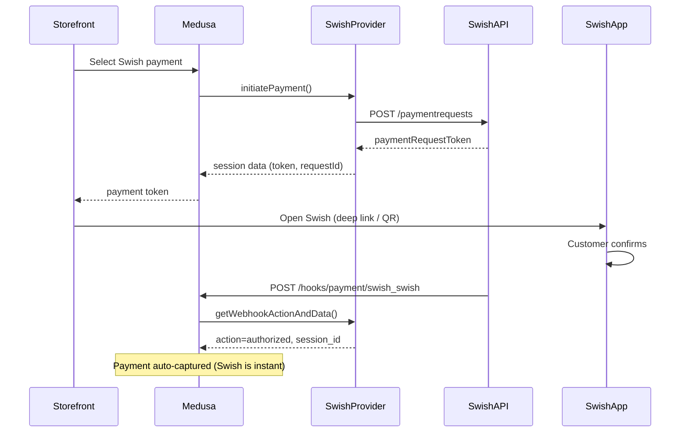

# Payment Swish

P1 priority. Sweden's dominant mobile payment -- 8+ million users. Async flow: customer confirms in the Swish app, result comes back via webhook.

**Docs:** [docs/plugins/payments.md](docs/plugins/payments.md), [docs/providers/payment-swish.md](docs/providers/payment-swish.md)
**Package:** `@peyya/medusa-payment-swish` in `packages/payment-swish/`

---

## Phase 1 -- Scaffold

### Directory structure

```
packages/payment-swish/
  src/providers/swish/
    service.ts       # SwishProviderService extends AbstractPaymentProvider
    index.ts         # ModuleProvider(Modules.PAYMENT, { services: [...] })
    types.ts         # SwishOptions, SwishPaymentRequest, SwishCallback types
    client.ts        # Swish API HTTP client with mTLS
  package.json
  tsconfig.json
  README.md
```

### package.json

```json
{
  "name": "@peyya/medusa-payment-swish",
  "version": "0.0.1",
  "description": "Swish mobile payment provider for Medusa v2",
  "keywords": ["medusa-v2", "medusa-plugin-integration", "medusa-plugin-payment"],
  "exports": {
    ".": "./dist/index.js",
    "./providers/*": "./dist/providers/*/index.js"
  },
  "files": ["dist", ".medusa"],
  "scripts": {
    "build": "npx medusa plugin:build",
    "test": "vitest run"
  },
  "devDependencies": {
    "@medusajs/framework": "^2.5.0",
    "@medusajs/medusa": "^2.5.0",
    "@medusajs/cli": "^2.5.0",
    "@swc/core": "^1.5.7"
  },
  "peerDependencies": {
    "@medusajs/framework": "^2.5.0",
    "@medusajs/medusa": "^2.5.0"
  }
}
```

No third-party Swish SDK on npm -- we build the HTTP client ourselves using Node `https` with client certificates.

---

## Phase 2 -- Types (`types.ts`)

```typescript
type SwishOptions = {
  certificatePath: string       // P12 or PEM cert file path
  certificatePassword?: string  // Password for P12
  callbackUrl: string           // Public URL for Swish callbacks
  payeeAlias: string            // Merchant Swish number (123xxxxxxx)
  environment: "test" | "production"
}

type SwishPaymentRequest = {
  payeePaymentReference: string // Our session_id
  callbackUrl: string
  payerAlias?: string           // Customer phone (optional)
  payeeAlias: string
  amount: string                // "100" (no decimals)
  currency: "SEK"
  message?: string              // Shown in Swish app (max 50 chars)
}

type SwishCallback = {
  id: string
  payeePaymentReference: string // Our session_id
  paymentReference: string
  status: "CREATED" | "PAID" | "DECLINED" | "ERROR" | "CANCELLED"
  amount: number
  currency: "SEK"
  errorCode?: string
  errorMessage?: string
}
```

Currency: SEK only. Amount format: no minor units -- Medusa stores `100.00`, Swish API expects `"100"`.

---

## Phase 3 -- Swish API Client (`client.ts`)

A thin HTTP wrapper handling mTLS:

- **mTLS setup** -- load P12/PEM certificate, configure `https.Agent` with `pfx`/`cert`+`key`
- **Endpoints:**
  - Production: `https://cpc.getswish.net/swish-cpcapi/api/v2`
  - Test: `https://mss.cpc.getswish.net/swish-cpcapi/api/v2`
- **Methods:**
  - `createPaymentRequest(payload)` -- POST `/paymentrequests`
  - `getPaymentRequest(id)` -- GET `/paymentrequests/{id}`
  - `createRefund(payload)` -- POST `/refunds`
  - `getRefund(id)` -- GET `/refunds/{id}`
  - `cancelPaymentRequest(id)` -- PATCH `/paymentrequests/{id}` (only if status=CREATED)

---

## Phase 4 -- Provider Service (`service.ts`)

```
class SwishProviderService extends AbstractPaymentProvider<SwishOptions>
  static identifier = "swish"
```

### Method implementation map


| Method                     | Swish behavior                                                                                                |
| -------------------------- | ------------------------------------------------------------------------------------------------------------- |
| `validateOptions` (static) | Require `certificatePath`, `callbackUrl`, `payeeAlias`                                                        |
| `initiatePayment`          | Create Swish payment request; store `paymentRequestId` + token in session data; return token for QR/deep link |
| `authorizePayment`         | Return `{ status: "pending", data }` -- Swish is async, real auth comes via webhook                           |
| `getWebhookActionAndData`  | Parse Swish callback; map PAID→authorized+captured, DECLINED/ERROR→failed; extract session_id                 |
| `capturePayment`           | No-op -- Swish auto-captures on PAID; return existing data                                                    |
| `refundPayment`            | Call Swish refund API; handle partial refunds                                                                 |
| `cancelPayment`            | Cancel pending request (PATCH if status=CREATED)                                                              |
| `deletePayment`            | Same as cancel -- cleanup pending request                                                                     |
| `getPaymentStatus`         | Fetch current status from Swish API, map to Medusa status                                                     |
| `retrievePayment`          | Fetch payment request details from Swish API                                                                  |
| `updatePayment`            | Cancel old request + create new one if amount changed                                                         |


### Amount conversion

```typescript
// Medusa stores 100.00, Swish expects "100"
const swishAmount = String(Math.round(input.amount))
```

### session_id linking

`initiatePayment` stores `session_id` in Swish's `payeePaymentReference` field. `getWebhookActionAndData` reads it back from the callback's `payeePaymentReference` to link the webhook to the correct Medusa payment session.

---

## Swish Async Payment Flow




---

## Phase 5 -- Module Provider Export (`index.ts`)

```typescript
import SwishProviderService from "./service"
import { ModuleProvider, Modules } from "@medusajs/framework/utils"

export default ModuleProvider(Modules.PAYMENT, {
  services: [SwishProviderService],
})
```

---

## Phase 6 -- Consumer Configuration

```typescript
module.exports = defineConfig({
  plugins: [
    { resolve: "@peyya/medusa-payment-swish", options: {} },
  ],
  modules: [
    {
      resolve: "@medusajs/medusa/payment",
      options: {
        providers: [
          {
            resolve: "@peyya/medusa-payment-swish/providers/swish",
            id: "swish",
            options: {
              certificatePath: process.env.SWISH_CERT_PATH,
              certificatePassword: process.env.SWISH_CERT_PASSWORD,
              callbackUrl: process.env.SWISH_CALLBACK_URL,
              payeeAlias: process.env.SWISH_PAYEE_ALIAS,
              environment: process.env.SWISH_ENV || "test",
            },
          },
        ],
      },
    },
  ],
})
```

Webhook route: `POST /hooks/payment/swish_swish` (auto-exposed by Medusa).

---

## Phase 7 -- Tests and README

### Unit tests (Vitest)

- `initiatePayment` -- verify payment request created, token returned
- `authorizePayment` -- verify pending status returned
- `getWebhookActionAndData` -- verify PAID/DECLINED/ERROR mapping, session_id extraction
- `capturePayment` -- verify no-op returns existing data
- `refundPayment` -- verify refund API called, partial amount handled
- `cancelPayment` -- verify cancel API called
- `validateOptions` -- verify missing cert/callback throws MedusaError
- `client.ts` -- verify endpoint selection per environment, cert loading

### README

- Installation and peer dependencies
- Certificate setup guide (test environment + production Swish certificates)
- Consumer config example with all env vars
- Webhook URL setup instructions
- Troubleshooting (common cert errors)

---

## Key Decisions

- **No third-party SDK** -- Swish has no official npm SDK; we build a thin HTTP client with mTLS
- **Auto-capture** -- Swish captures immediately on PAID; `capturePayment` is a no-op
- **session_id via payeePaymentReference** -- Swish's reference field is the bridge between webhook callbacks and Medusa payment sessions
- **Amount as integer string** -- Medusa stores decimals, Swish expects integer string in SEK (no öre)

