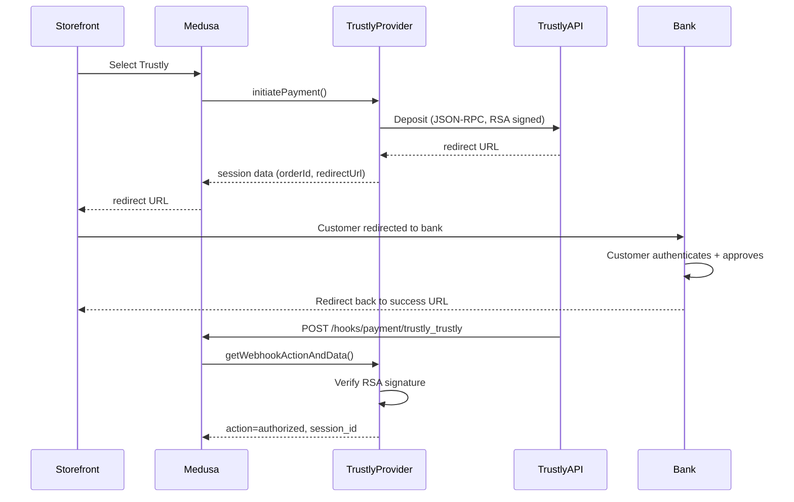

# Payment Trustly

P3 priority. Bank-to-bank transfers -- customer is redirected to their bank login. Popular for high-value transactions where card fees are undesirable.

**Docs:** [docs/plugins/payments.md](docs/plugins/payments.md), [docs/providers/payment-trustly.md](docs/providers/payment-trustly.md)
**Package:** `@peyya/medusa-payment-trustly` in `packages/payment-trustly/`

---

## Phase 1 -- Scaffold

```
packages/payment-trustly/
  src/providers/trustly/
    service.ts       # TrustlyProviderService extends AbstractPaymentProvider
    index.ts         # ModuleProvider export
    types.ts         # TrustlyOptions, deposit/notification types
    client.ts        # Trustly JSON-RPC client with RSA signing
    crypto.ts        # RSA signature creation and verification
  package.json
  tsconfig.json
  README.md
```

### package.json

```json
{
  "name": "@peyya/medusa-payment-trustly",
  "version": "0.0.1",
  "description": "Trustly bank-to-bank payment provider for Medusa v2",
  "keywords": ["medusa-v2", "medusa-plugin-integration", "medusa-plugin-payment"],
  "exports": {
    ".": "./dist/index.js",
    "./providers/*": "./dist/providers/*/index.js"
  },
  "devDependencies": {
    "@medusajs/framework": "^2.5.0",
    "@medusajs/medusa": "^2.5.0",
    "@medusajs/cli": "^2.5.0",
    "@swc/core": "^1.5.7"
  },
  "peerDependencies": {
    "@medusajs/framework": "^2.5.0",
    "@medusajs/medusa": "^2.5.0"
  }
}
```

---

## Phase 2 -- Types

```typescript
type TrustlyOptions = {
  username: string
  password: string
  privateKeyPath: string     // RSA private key for signing
  publicKeyPath?: string     // Trustly's public key for verification
  environment: "test" | "production"
}
```

Currencies: SEK, EUR, NOK, DKK. Amount format: standard decimal (not minor units).

---

## Phase 3 -- Trustly JSON-RPC Client

Trustly uses JSON-RPC 1.1 with RSA-signed requests.

- **Endpoints:**
  - Test: `https://test.trustly.com/api/1`
  - Production: `https://api.trustly.com/1`
- **Request signing:** Each request body is serialized, signed with merchant's RSA private key, and sent with the signature
- **Response verification:** Response signature verified against Trustly's public key
- **Methods:**
  - `deposit(payload)` -- initiate bank deposit
  - `refund(orderId, amount)` -- refund a deposit
  - `getWithdrawals(orderId)` -- check withdrawal status

### crypto.ts

RSA signature utilities using Node `crypto`:

```typescript
function signData(data: string, privateKey: string): string
function verifySignature(data: string, signature: string, publicKey: string): boolean
```

---

## Phase 4 -- Provider Service

```
class TrustlyProviderService extends AbstractPaymentProvider<TrustlyOptions>
  static identifier = "trustly"
```

| Method                     | Trustly behavior                                                            |
| -------------------------- | --------------------------------------------------------------------------- |
| `validateOptions` (static) | Require `username`, `password`, `privateKeyPath`                            |
| `initiatePayment`          | Call Trustly Deposit; return bank redirect URL in data                      |
| `authorizePayment`         | Check deposit status; if completed, return authorized                       |
| `getWebhookActionAndData`  | Parse Trustly notification; verify RSA signature; map to Medusa actions     |
| `capturePayment`           | Trustly auto-captures on deposit completion; return existing data           |
| `refundPayment`            | Call Trustly refund; handle partial refunds                                 |
| `cancelPayment`            | Cancel pending deposit if possible                                          |
| `deletePayment`            | Clean up pending deposit                                                    |
| `getPaymentStatus`         | Fetch deposit status via API                                                |
| `retrievePayment`          | Fetch full deposit details                                                  |
| `updatePayment`            | Cancel + re-create deposit if amount changed                                |

### Trustly bank redirect flow



---

## Phase 5 -- Consumer Configuration

```typescript
module.exports = defineConfig({
  modules: [{
    resolve: "@medusajs/medusa/payment",
    options: {
      providers: [{
        resolve: "@peyya/medusa-payment-trustly/providers/trustly",
        id: "trustly",
        options: {
          username: process.env.TRUSTLY_USERNAME,
          password: process.env.TRUSTLY_PASSWORD,
          privateKeyPath: process.env.TRUSTLY_PRIVATE_KEY_PATH,
          environment: process.env.TRUSTLY_ENV || "test",
        },
      }],
    },
  }],
})
```

Webhook route: `POST /hooks/payment/trustly_trustly`

---

## Phase 6 -- Tests and README

### Unit tests

- RSA signing/verification with test fixtures
- `initiatePayment` -- deposit created, redirect URL returned
- `getWebhookActionAndData` -- notification parsed, signature verified
- `refundPayment` -- refund API called with correct amount
- `validateOptions` -- missing RSA key throws

### README

- Installation, RSA key generation guide, config, webhook setup
- Security notes (RSA key storage best practices)

---

## Key Decisions

- **RSA signing** -- Node `crypto` module, no third-party RSA library
- **Auto-capture** -- Trustly deposits are captured immediately; `capturePayment` is a no-op
- **Standard decimal amounts** -- Trustly uses standard decimal (not minor units), unlike Klarna/Qliro
